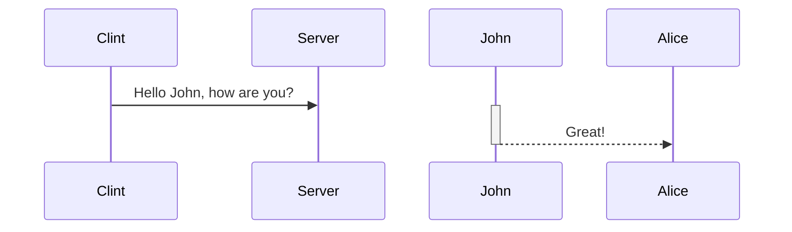

살다살다 이렇게도 공부해보네. 이것이 미래다 멸망편같다. SNI 관련하여 이슈가 발생하여 어떤 과정을 거쳐서 진행될 수 있는것인지 확인해보고 그점을 개선하는 ESNI란 뭔지 함 찾아봤다. 물론 그 기반인 TLS 먼저.

# TLS
TCP/IP 네트워크를 사용하는 통신에 적용되며, 통신 과정에서 전송계층 종단간 보안과 데이터 무결성을 확보해준다.

# SNI
[wiki](https://ko.wikipedia.org/wiki/%EC%84%9C%EB%B2%84_%EB%84%A4%EC%9E%84_%EC%9D%B8%EB%94%94%EC%BC%80%EC%9D%B4%EC%85%98) 에선 SNI(**S**erver **N**ame **I**ndication)를 

# ESNI
https://www.eff.org/deeplinks/2018/09/esni-privacy-protecting-upgrade-https
<!--stackedit_data:
eyJoaXN0b3J5IjpbLTE4NzE2OTQ1NTNdfQ==
-->