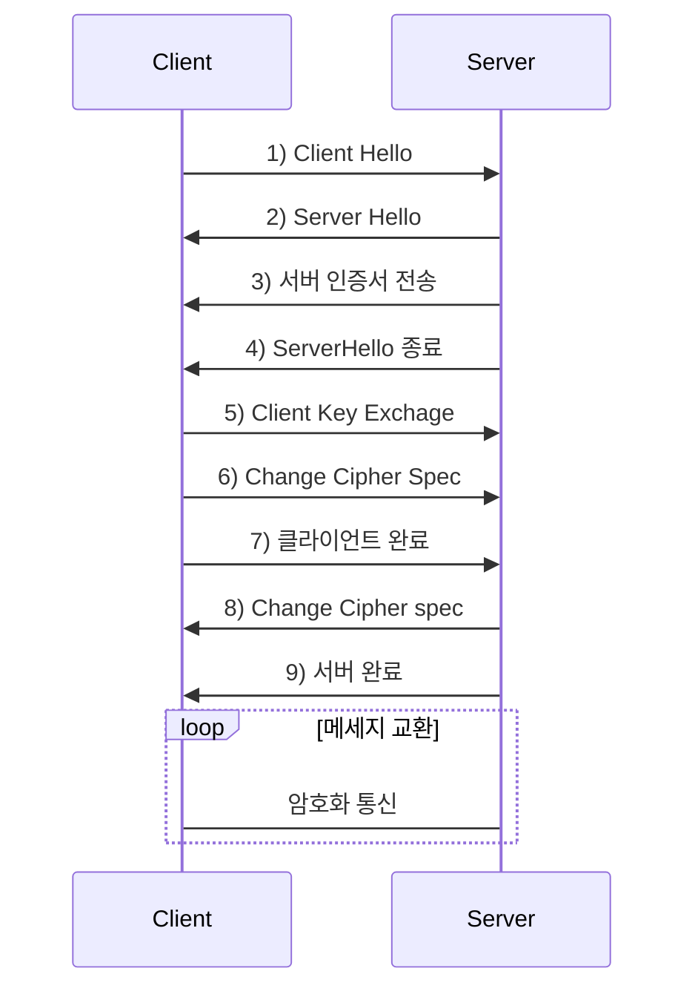

살다살다 이렇게도 공부해보네. 이것이 미래다 멸망편같다. SNI 관련하여 이슈가 발생하여 어떤 과정을 거쳐서 진행될 수 있는것인지 확인해보고 그점을 개선하는 ESNI란 뭔지 함 찾아봤다. 물론 그 기반인 TLS 먼저.

# TLS
TCP/IP 네트워크를 사용하는 통신에 적용되며, 통신 과정에서 전송계층 종단간 보안과 데이터 무결성을 확보해준다.
## TLS Handshake

1.  The SSL or TLS client sends a  "client hello"  message that lists cryptographic information such as the SSL or TLS version and, in the client's order of preference, the CipherSuites supported by the client. The message also contains a random byte string that is used in subsequent computations. The protocol allows for the  "client hello"  to include the data compression methods supported by the client.
2.  The SSL or TLS server responds with a  "server hello"  message that contains the CipherSuite chosen by the server from the list provided by the client, the session ID, and another random byte string. The server also sends its digital certificate. If the server requires a digital certificate for client authentication, the server sends a  "client certificate request"  that includes a list of the types of certificates supported and the Distinguished Names of acceptable Certification Authorities (CAs).
3.  The SSL or TLS client verifies the server's digital certificate. For more information, see  [How SSL and TLS provide identification, authentication, confidentiality, and integrity](https://www.ibm.com/support/knowledgecenter/SSFKSJ_7.1.0/com.ibm.mq.doc/sy10670_.htm?view=kc).
4.  The SSL or TLS client sends the random byte string that enables both the client and the server to compute the secret key to be used for encrypting subsequent message data. The random byte string itself is encrypted with the server's public key.
5.  If the SSL or TLS server sent a  "client certificate request", the client sends a random byte string encrypted with the client's private key, together with the client's digital certificate, or a  "no digital certificate alert". This alert is only a warning, but with some implementations the handshake fails if client authentication is mandatory.
6.  The SSL or TLS server verifies the client's certificate. For more information, see  [How SSL and TLS provide identification, authentication, confidentiality, and integrity](https://www.ibm.com/support/knowledgecenter/SSFKSJ_7.1.0/com.ibm.mq.doc/sy10670_.htm?view=kc).
7.  The SSL or TLS client sends the server a  "finished"  message, which is encrypted with the secret key, indicating that the client part of the handshake is complete.
8.  The SSL or TLS server sends the client a  "finished"  message, which is encrypted with the secret key, indicating that the server part of the handshake is complete.
9.  For the duration of the SSL or TLS session, the server and client can now exchange messages that are symmetrically encrypted with the shared secret key.
# SNI
[wiki](https://ko.wikipedia.org/wiki/%EC%84%9C%EB%B2%84_%EB%84%A4%EC%9E%84_%EC%9D%B8%EB%94%94%EC%BC%80%EC%9D%B4%EC%85%98) 에선 SNI(**S**erver **N**ame **I**ndication)를 

# ESNI
https://www.eff.org/deeplinks/2018/09/esni-privacy-protecting-upgrade-https
<!--stackedit_data:
eyJoaXN0b3J5IjpbMjA0NTk5OTc0NSwtNDY2MDUyNCwtNzQxNz
Y1MDY3LC0xODcxNjk0NTUzXX0=
-->