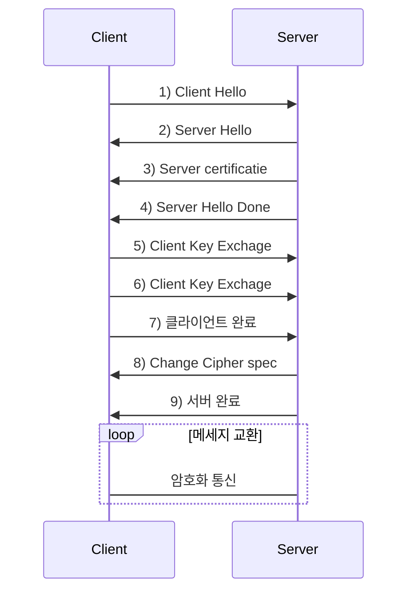

살다살다 이렇게도 공부해보네. 이것이 미래다 멸망편같다. SNI 관련하여 이슈가 발생하여 어떤 과정을 거쳐서 진행될 수 있는것인지 확인해보고 그점을 개선하는 ESNI란 뭔지 함 찾아봤다. 물론 그 기반인 TLS 먼저.

# TLS
TCP/IP 네트워크를 사용하는 통신에 적용되며, 통신 과정에서 전송계층 종단간 보안과 데이터 무결성을 확보해준다.
## TLS Handshake

1.  통신상태 확인을 위한 hello 메세지로 정보 교환 (tls 버전, 암호 모음 목록, 난수 및 압축 방법 목록)
2.  통신상태 확인을 위한 hello 메세지로 정보 교환 (tls 버전, 암호 모음 목록, 난수 및 압축 방법 목록)
3.  서버의 디지털 인증서를 확인합니다.
4.  클라이언트와 서버가 후속 메시지 데이터를 암호화하는 데 사용될 비밀 키를 계산할 수 있도록하는 임의의 바이트 문자열을 보냅니다. 임의의 바이트 문자열 자체는 서버의 공개 키로 암호화됩니다.
5.  "클라이언트 인증서 요청" 을 보낸 경우 클라이언트는 클라이언트의 디지털 인증서 또는 "디지털 인증서 경고 없음" 과 함께 클라이언트의 개인 키로 암호화 된 임의의 바이트 문자열을 보냅니다 . 이 경고는 경고 일 뿐이지 만 일부 구현에서는 클라이언트 인증이 필수 일 경우 핸드 셰이크가 실패합니다.
6.  The SSL or TLS server verifies the client's certificate. For more information, see  [How SSL and TLS provide identification, authentication, confidentiality, and integrity](https://www.ibm.com/support/knowledgecenter/SSFKSJ_7.1.0/com.ibm.mq.doc/sy10670_.htm?view=kc).
7.  The SSL or TLS client sends the server a  "finished"  message, which is encrypted with the secret key, indicating that the client part of the handshake is complete.
8.  The SSL or TLS server sends the client a  "finished"  message, which is encrypted with the secret key, indicating that the server part of the handshake is complete.
9.  For the duration of the SSL or TLS session, the server and client can now exchange messages that are symmetrically encrypted with the shared secret key.
# SNI
[wiki](https://ko.wikipedia.org/wiki/%EC%84%9C%EB%B2%84_%EB%84%A4%EC%9E%84_%EC%9D%B8%EB%94%94%EC%BC%80%EC%9D%B4%EC%85%98) 에선 SNI(**S**erver **N**ame **I**ndication)를 

# ESNI
https://www.eff.org/deeplinks/2018/09/esni-privacy-protecting-upgrade-https
<!--stackedit_data:
eyJoaXN0b3J5IjpbMTUwOTAzNDMyOCwxODQyNzM3MzkzLC00Nj
YwNTI0LC03NDE3NjUwNjcsLTE4NzE2OTQ1NTNdfQ==
-->