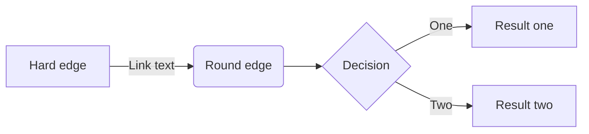
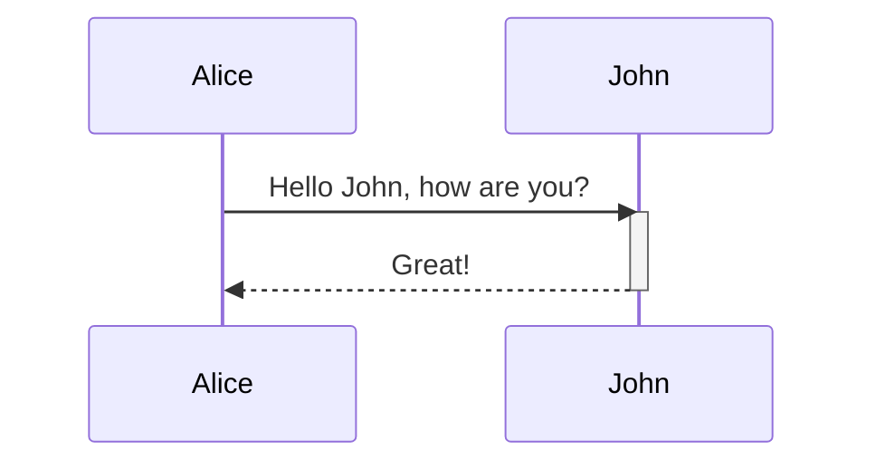
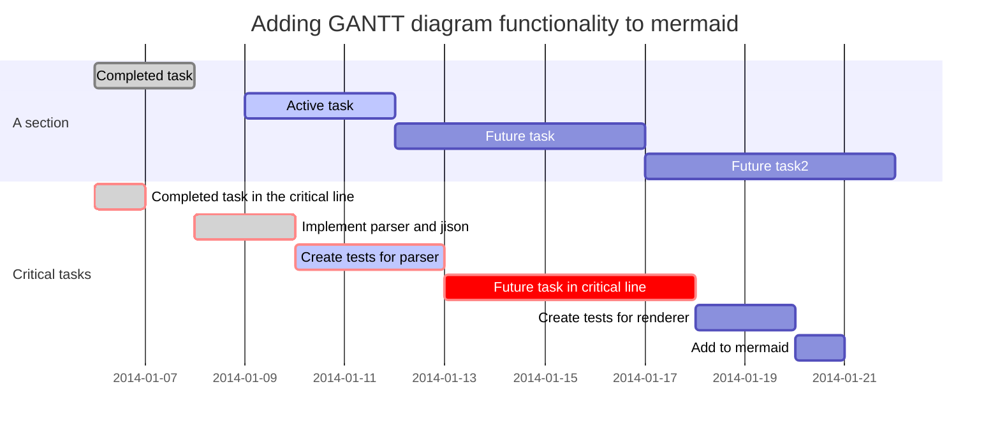

# mermaid
markdown 기반 flow chart, sequence / class diagram, gantt chart, git graph 등을 표현할 수 있는 API


## Flowchart [#](https://mermaidjs.github.io/flowchart.html)



## Sequence Diagram[#](https://mermaidjs.github.io/sequenceDiagram.html)




## Ganttchart[#](https://mermaidjs.github.io/gantt.html)


# Blog Setting

```javascript
mermaid.initialize({ startOnLoad:true, theme: 'forest' });
window.mermaid.init(undefined, document.querySelectorAll('.language-mermaid'));
```

현재 이 블로그에서 위와 같은 설정을 통해 markdown 방식으로 아래와 같은 형태로 사용 가능
> \```mermaid
> sequenceDiagram
>    Alice->>John: Hello John, how are you?
> \```
<!--stackedit_data:
eyJoaXN0b3J5IjpbLTU5MDc0MzY4MiwtMzk2MTM5NTc3LC0xMj
IxMzc4NzkxLC04MzM4MDU3NTUsLTE4OTg2MDEzMjMsLTE0MDcx
NzE5MDIsNzgzODA3OTc4LC04NjU5NDM3ODBdfQ==
-->