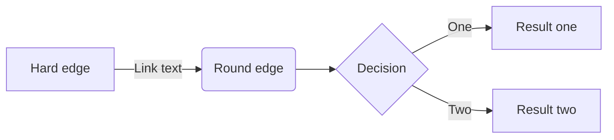
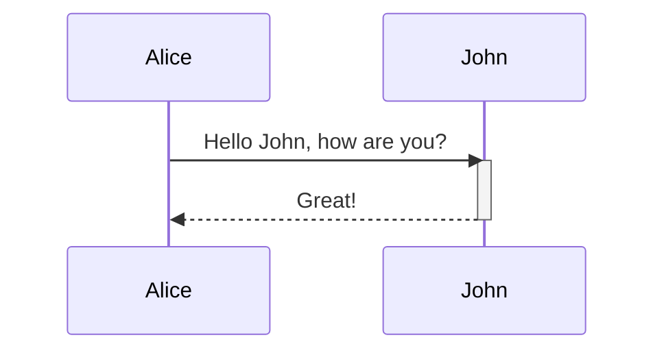

# mermaid
markdown 기반 flow chart, sequence / class diagram, gantt chart, git graph 등을 표현할 수 있는 API

## Flowchart [#](https://mermaidjs.github.io/flowchart.html)

## Sequence Diagram[#](https://mermaidjs.github.io/sequenceDiagram.html)

<!--stackedit_data:
eyJoaXN0b3J5IjpbLTgzMzgwNTc1NSwtMTg5ODYwMTMyMywtMT
QwNzE3MTkwMiw3ODM4MDc5NzgsLTg2NTk0Mzc4MF19
-->