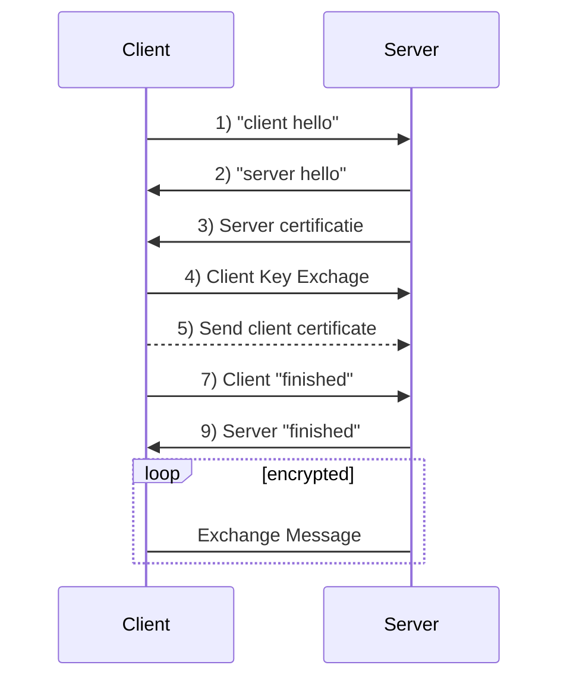

살다살다 이렇게도 공부해보네. 이것이 미래다 멸망편같다. SNI 관련하여 이슈가 발생하여 어떤 과정을 거쳐서 진행될 수 있는것인지 확인해보고 그점을 개선하는 ESNI란 뭔지 함 찾아봤다. 물론 그 기반인 TLS 먼저.

# TLS
TCP/IP 네트워크를 사용하는 통신에 적용되며, 통신 과정에서 전송계층 종단간 보안과 데이터 무결성을 확보해준다.

## CA

## TLS Handshake

1.  통신상태 확인을 위한 hello 메시지로 정보 교환, 클라이언트에서 사용 가능한 TLS 버전, 암호 모음 목록, 난수 및 압축 방법 목록 등 포함합니다.
2.  통신상태 확인을 위한 hello 메시지로 정보 교환, 서버에서 사용할 TLS 버전, 암호 모음 목록, 난수 및 압축 방법 목록 등을 포함합니다.
3.  서버의 디지털 인증서를 유효기간과 발급된 서버가 올바른지 등을 확인합니다.
4.  클라이언트와 서버가 후속 메시지 데이터를 암호화하는 데 사용될 비밀 키를 계산할 수 있도록 하는 임의의 바이트 문자열을 보냅니다. 임의의 바이트 문자열 자체는 서버의 공개키로 암호화됩니다.
5.  만약 "클라이언트 인증서 요청"을 보낸 경우 클라이언트는 클라이언트의 디지털 인증서 또는 "디지털 인증서 경고 없음"과 함께 클라이언트의 개인 키로 암호화된 임의의 바이트 문자열을 보냅니다. 이 경고는 경고일 뿐이지만 일부 구현에서는 클라이언트 인증이 필수 일 경우 Handshake가 실패합니다.
6.  클라이언트의 인증서를 확인합니다.
7.  Handshake의 클라이언트 부분이 완료되었음을 나타내는 "완료" 메시지를 비밀키로 암호화합니다.
8.  Handshake의 서버 부분이 완료되었음을 나타내는 "완료" 메시지를 비밀키로 암호화합니다.
9.  서버와 클라이언트는 이제 공유 비밀키로 대칭적으로 암호화된 메시지를 교환할 수 있습니다.
 
# SNI
[wiki](https://ko.wikipedia.org/wiki/%EC%84%9C%EB%B2%84_%EB%84%A4%EC%9E%84_%EC%9D%B8%EB%94%94%EC%BC%80%EC%9D%B4%EC%85%98) 에선 SNI(**S**erver **N**ame **I**ndication)를 

# ESNI
https://www.eff.org/deeplinks/2018/09/esni-privacy-protecting-upgrade-https

# 참조
- https://www.internetsociety.org/deploy360/tls/basics/  
<!--stackedit_data:
eyJoaXN0b3J5IjpbMTQ1NTMxMDgxOSwtNzUwMzM2Njg1LC0xND
cwNzMyODgyLC03NTM3MzM4NywtMjMxNTQ3MTc2XX0=
-->