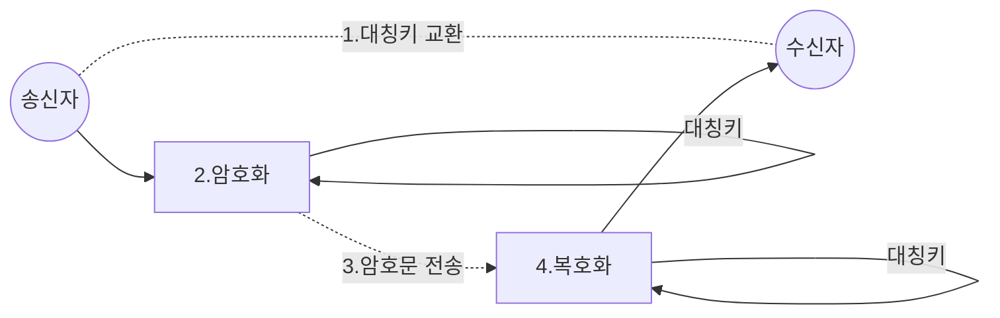
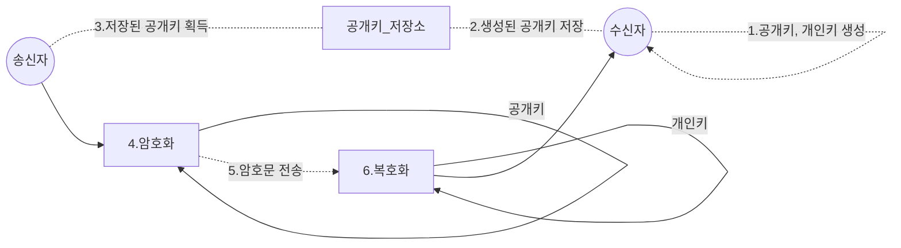

살다살다 이렇게도 공부해보네. 이것이 미래다 멸망편같다. SNI 관련하여 이슈가 발생하여 어떤 과정을 거쳐서 진행될 수 있는것인지 확인해보고 그점을 개선하는 ESNI란 뭔지 함 찾아봤다. 물론 그 기반인 TLS 먼저.

# TLS
TCP/IP 네트워크를 사용하는 통신에 적용되며, 통신 과정에서 전송계층 종단간 보안과 데이터 무결성을 확보해준다.

## TLS 암호화
TLS는 대칭 및 비대칭 암호화 조합을 사용하며,이는 데이터를 안전하게 전송할 때 성능과 보안간에 좋은 절충안을 제공하기 때문입니다.

### 대칭 암호화
대칭 암호화를 사용하면 데이터는 보낸 사람과받는 사람 모두에게 알려진 비밀 키로 암호화되고 해독됩니다. 대칭 암호화는 연산 속도면에서 효율적이지만 공통의 비밀 키를 안전한 방식으로 공유해야 할 필요가 있음을 의미합니다.

### 비대칭 암호화
비대칭 암호화 혹은 공유키 방식은 출제자만이 알고 있는 특정한 종류의 정보(비밀 키) 없이는 매우 풀기 어려운 수학적 문제(공개 키)를 바탕으로 만들어진다. 키를 만드는 사람은 이 문제(공개 키)를 일반에 공개하고 특정한 정보(비밀 키)는 자신만이 알수 있도록 숨긴다. 그러면 어떤 사람이건 이 문제를 이용해 메시지를 암호화하면 키를 만든 사람만이 이 문제를 풀어 원래 메시지를 해독할 수 있다.

## CA
CA(**C**ertificate **A**uthority)는 X.509 표준을 준수하는 디지털 인증서를 발급하는 곳 입니다. 디지털 인증서는 인증서 소유자 (주체)의 공개 키를 인증하고 소유자는 인증서로 보호되는 도메인을 제어합니다. 따라서 신뢰할 수있는 제 3 자로서의 역할을 수행하여 클라이언트가 검증 된 서버에 연결한다는 보증을 제공합니다.

## TLS Handshake

1.  통신상태 확인을 위한 hello 메시지로 정보 교환, 클라이언트에서 사용 가능한 TLS 버전, 암호 모음 목록, 난수 및 압축 방법 목록, SNI 등이 포함합니다.
2.  통신상태 확인을 위한 hello 메시지로 정보 교환, 서버에서 사용할 TLS 버전, 암호 모음 목록, 난수 및 압축 방법 목록 등을 포함합니다.
3.  서버의 디지털 인증서를 유효기간과 발급된 서버가 올바른지 등을 확인합니다.
4.  클라이언트와 서버가 후속 메시지 데이터를 암호화하는 데 사용될 비밀 키를 계산할 수 있도록 하는 임의의 바이트 문자열을 보냅니다. 임의의 바이트 문자열 자체는 서버의 공개키로 암호화됩니다.
5.  만약 "클라이언트 인증서 요청"을 보낸 경우 클라이언트는 클라이언트의 디지털 인증서 또는 "디지털 인증서 경고 없음"과 함께 클라이언트의 개인 키로 암호화된 임의의 바이트 문자열을 보냅니다. 이 경고는 경고일 뿐이지만 일부 구현에서는 클라이언트 인증이 필수 일 경우 Handshake가 실패합니다.
6.  클라이언트의 인증서를 확인합니다.
7.  Handshake의 클라이언트 부분이 완료되었음을 나타내는 "완료" 메시지를 비밀키로 암호화합니다.
8.  Handshake의 서버 부분이 완료되었음을 나타내는 "완료" 메시지를 비밀키로 암호화합니다.
9.  서버와 클라이언트는 이제 공유 비밀키로 대칭적으로 암호화된 메시지를 교환할 수 있습니다.

 
# SNI
SNI(**S**erver **N**ame **I**ndication)는 TLS 프로토콜의 확장입니다.  클라이언트는 TLS 핸드 셰이크의 SNI 확장을 사용하여 연결할 호스트 이름을 지정합니다. 이렇게하면 서버 (예Apache, Nginx 또는 HAProxy와 같은 로드 밸런서)가 단일 IP 주소의 모든 인증서를 호스팅하는 동안 목록이나 데이터베이스에서 연결을 설정하는 데 필요한 해당 개인 키와 인증서 체인을 선택할 수 있습니다.

# ESNI
https://www.eff.org/deeplinks/2018/09/esni-privacy-protecting-upgrade-https

# 참조
- https://www.internetsociety.org/deploy360/tls/basics/  
- https://ko.wikipedia.org/wiki/%EC%84%9C%EB%B2%84_%EB%84%A4%EC%9E%84_%EC%9D%B8%EB%94%94%EC%BC%80%EC%9D%B4%EC%85%98
- https://www.globalsign.com/en/blog/what-is-server-name-indication/
<!--stackedit_data:
eyJoaXN0b3J5IjpbODIzODk3Njc5LDQ4NzM1NzE2OSwtMjA4OT
g3MjU1OSwxNDU1MzEwODE5LC03NTAzMzY2ODUsLTE0NzA3MzI4
ODIsLTc1MzczMzg3LC0yMzE1NDcxNzZdfQ==
-->