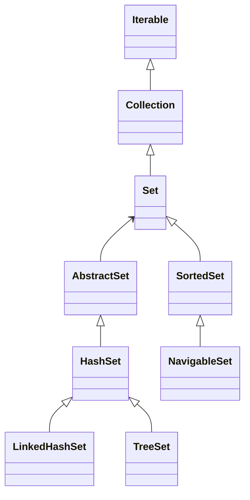

# Collection

## List
## Set
# Map

```mermaid
classDiagram
Iterable <|-- Collection
Collection <|-- Set
Set <-- AbstractSet
AbstractSet <|-- HashSet
HashSet <|-- LinkedHashSet
Set <|-- SortedSet
SortedSet <|-- NavigableSet
HashSet <|-- TreeSet
```
<!--stackedit_data:
eyJoaXN0b3J5IjpbMTI5MDM0Mzc2NCwzMzA2MzQ0MjhdfQ==
-->