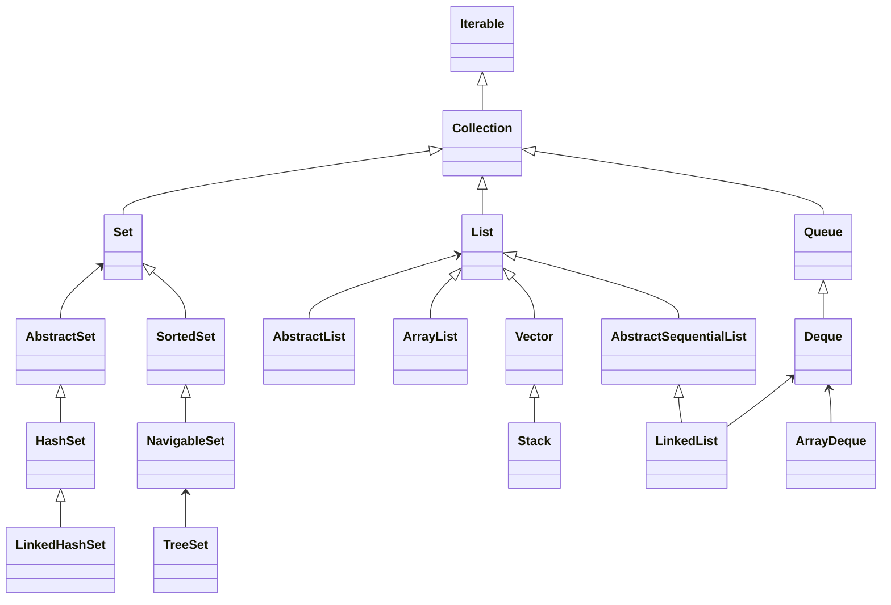
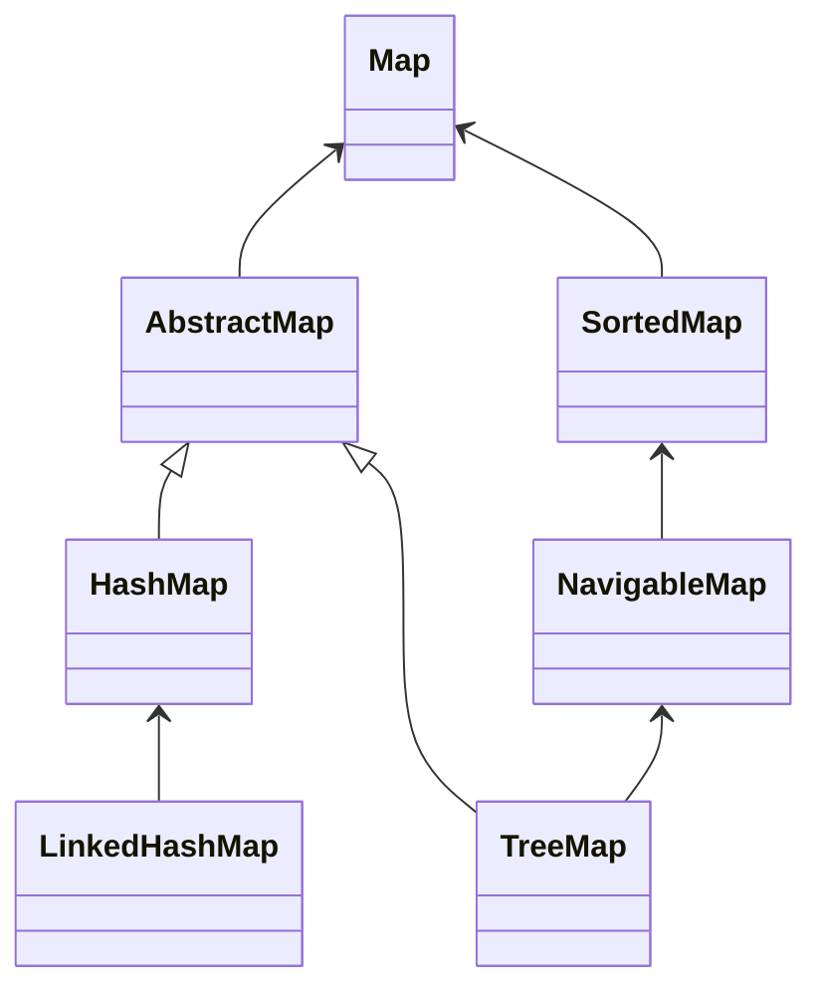

Collections 와 Map 의 하위구조들

# Collections

- Iterable : 컬렉션에 대한 반복 처리를 제공합니다.
- Collection :  개체의 추가 및 제거, 컬렉션 내에 개체 포함여부, 컬렉션의 개체 개수 등의 기능을 제공합니다.
- Set : 개체의 중복을 허용하지 않습니다.
	- HashSet : _Hashing_ 을 통해 구현되었으며 개체의 순서를 보장하지 않습니다.
		> **Hashing**  
		> 해시함수(hash function)란 데이터의 효율적 관리를 위해 key를 고정된 길이의 hash로 매핑하는 함수입니다. 이 때 매핑 전 원래 데이터의 값을 키(key), 매핑 후 데이터의 값을 해시값(hash value), 매핑하는 과정 자체를 **해싱(hashing)** 이라고 합니다. 키값 중복으로 인해 hash 값에 대해 충돌이
		> 
		
	- LinkedHashSet : _double-linked list_ 로써 개체간의 순서를 보장합니다.
	- TreeSet :  이진탐색트리(BinarySearchTree)의 형태로 데이터를 저장하며 순서를 유지하지 않습니다. 검색, 정렬이 뛰어나나 개체 추가/삭제는 시간이 소요됩니다.
		> **BinarySearchTree**  
		> 123
		
		
- List : 정렬된 순차 컬랙션입니다.
	- ArrayList : 유동적 길이를 가진 배열입니다.
	- Vector : _ArrayList_ 와 비슷하게 유동적인 배열입니다. Thread-safe 나 Synchronization 을 위해서 사용됩니다.
	- Stock : LIFO(**L**ast-**I**n-**F**irst-**O**ut) 형태의 배열입니다. _Vector_의 하위클래스로서 Thread-safe 합니다.
	- LikedList : _double-linked list_ 로 개체간에 연결되어 있습니다.  그로인해 intermediate 위치에 추가 / 삭제가 빠릅니다. _Deque_ 클래스도 구현합니다
- Queue : FIFO (**F**irst-**I**n-**F**irst-**O**ut) 형태의 배열입니다. Typical usage is storage to hold elements before processing in the order of receipt.
	- Deque(**D**ouble-**E**nded-**Que**ue) :  can add and remove elements at both ends.
	- ArrayDeque : implementation of  _Deque_  using an array for storage.

# Map

- Map : 키(key)와 값(value)으로 개채 관리합니다.
- AbstractMap :
	- HashMap : Map 인터페이스 구현을 위해 _HashTable 을 사용하였습니다. 중복을 허용하지 않으며 키와 값에 null을 허용합니다.
	- HashTable :  _HashMap_ 보다는 느리지만 Synchronization가 지원됩니다.
	- LinkedHashMap :  _double-linked list_로써 키 간에 순서를 보장합니다.
	- TreeMap - 이진트리검색의 형태로 키/값 쌍으로 이루어진 개체를 저장합니다. 검색, 정렬이 뛰어나나 개체 추가/삭제는 시간이 소요됩니다.

# 참조
- https://dzone.com/articles/java-collections
- https://swalloow.tistory.com/36
- https://hackersstudy.tistory.com/26
<!--stackedit_data:
eyJoaXN0b3J5IjpbLTE1MjY5ODg0NjksLTE1NTgyNzY2NTQsNj
I1ODk1NjQzLDg2NzkxNTk4NCwtNjU0NDkyMjIxLC0xMzAwNTY4
MzExLDE0MTYwMTk0NjksMTAzMzkzNjg0OSwxNzAyNjkzMjI1LC
0xMDAyNzA4Nzc2LDY1OTkyODE1OCwxNjU3NDM5NTM2LDE1MDA4
MzIyMDUsLTgyMTQzMDYzMywxNDkxNTcwMTg0LDEyOTAzNDM3Nj
QsMzMwNjM0NDI4XX0=
-->