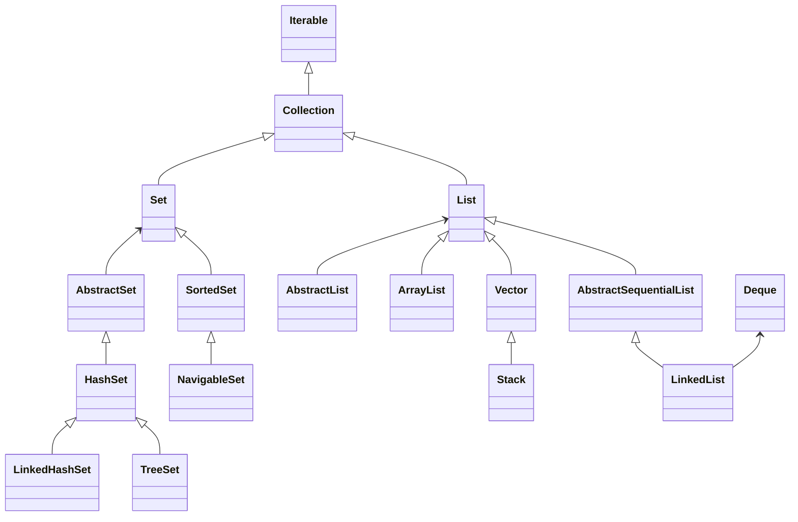

# Collection

1.  At the root of the hierarchy is  [_Iterable_](https://docs.oracle.com/javase/8/docs/api/java/lang/Iterable.html) which, as the name indicates, provides for iterating over the collection.
2.  The next is the  [Collection](https://docs.oracle.com/javase/8/docs/api/java/util/Collection.html) interface, which provides most of the methods representing a collection. These methods include providing for adding and removing elements, checking if the collection includes an element, and obtaining the number of elements in the collection.
3.  A  [_Set_](https://docs.oracle.com/javase/8/docs/api/java/util/Set.html) contains no duplicate elements. Common implementations are:
    -   [_HashSet_](https://docs.oracle.com/javase/8/docs/api/java/util/HashSet.html) does not provide any ordering of the elements in the  _Set_.
    -   [_LinkedHashSet_](https://docs.oracle.com/javase/8/docs/api/java/util/LinkedHashSet.html) maintains a double-linked list of the elements and thus provides a predictable iteration order.
    -   [_TreeSet_](https://docs.oracle.com/javase/8/docs/api/java/util/TreeSet.html) which uses a comparator function to maintain element ordering.
4.  A  _[List](https://docs.oracle.com/javase/8/docs/api/java/util/List.html)_  is an ordered sequential collection. Concrete implementations include:
    -   _[ArrayList](https://docs.oracle.com/javase/8/docs/api/java/util/ArrayList.html)_  is a re-sizable list backed by an array.
    -   [_Vector_](https://docs.oracle.com/javase/8/docs/api/java/util/Vector.html) is also a re-sizable array similar to an  _ArrayList_. Use it only when you need thread-safety and synchronization.
    -   [_Stack_](https://docs.oracle.com/javase/8/docs/api/java/util/Stack.html) is a LIFO(Last-In-First-Out) array. A subclass of  _Vector_  and is also thread-safe.
    -   [_LinkedList_](https://docs.oracle.com/javase/8/docs/api/java/util/LinkedList.html) is a doubly linked list of elements. Offers fast adds and removes from intermediate positions. Note that this class also implements the  [_Deque_](https://docs.oracle.com/javase/8/docs/api/java/util/Deque.html) interface.
5.  A  _[Queue](https://docs.oracle.com/javase/8/docs/api/java/util/Queue.html)_  orders elements in a FIFO (First-In-First-Out) order. The  _[add()](https://docs.oracle.com/javase/8/docs/api/java/util/Queue.html#add-E-)_  method adds elements at the tail and  _[remove()](https://docs.oracle.com/javase/8/docs/api/java/util/Queue.html#remove--)_  removes elements from the head. Typical usage is storage to hold elements before processing in the order of receipt.
6.  On the other hand, a  _[Deque](https://docs.oracle.com/javase/8/docs/api/java/util/Deque.html)_  (Double-Ended-Queue) can add and remove elements at both ends.
    -   [_ArrayDeque_](https://docs.oracle.com/javase/8/docs/api/java/util/ArrayDeque.html) is an implementation of  _Deque_  using an array for storage.
    -   A  _LinkedList_  is also a  _Deque_.
## List
## Set
# Map

# 참조
- https://dzone.com/articles/java-collections
<!--stackedit_data:
eyJoaXN0b3J5IjpbLTIxMTcwMTIyMjIsMTUwMDgzMjIwNSwtOD
IxNDMwNjMzLDE0OTE1NzAxODQsMTI5MDM0Mzc2NCwzMzA2MzQ0
MjhdfQ==
-->