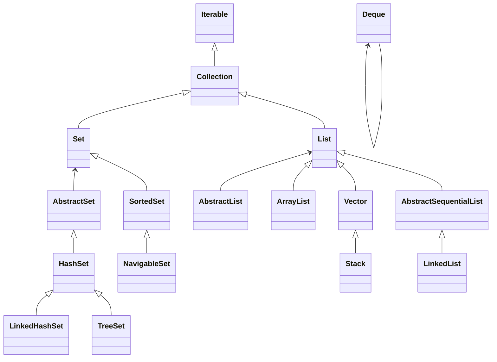

# Collection

```mermaid
classDiagram
Iterable <|-- Collection
Collection <|-- Set
Set <-- AbstractSet
AbstractSet <|-- HashSet
HashSet <|-- LinkedHashSet
Set <|-- SortedSet
SortedSet <|-- NavigableSet
HashSet <|-- TreeSet

Collection <|-- List
List <-- AbstractList
List <|-- ArrayList
List <|-- Vector
Vector <|-- Stack
List <|-- AbstractSequentialList
AbstractSequentialList <|-- LinkedList
Deque <-- Deque
```

## List
## Set
# Map

<!--stackedit_data:
eyJoaXN0b3J5IjpbMTQ5MTU3MDE4NCwxMjkwMzQzNzY0LDMzMD
YzNDQyOF19
-->